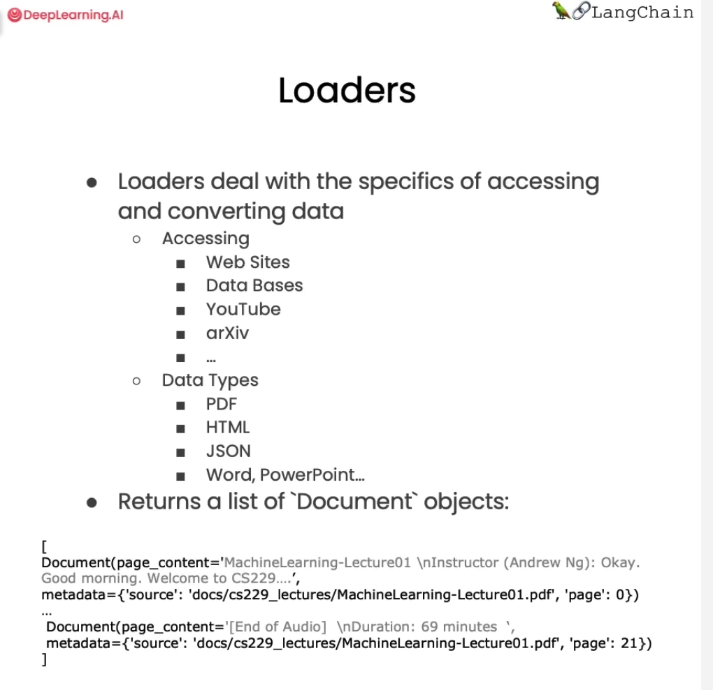

## Introduction

Large Langusge models or LLMs such as ChatGPT can answer questions about a lot of topics. But LLMs in isolation knows only what it was trained on, which doesn't include your personal data, such as if you're in a company and have proprietary documents not on the internet, as well as data or articles that were written after the LLM was trained.

So wouldn't it be useful if you or others such as your customers can have a conversation with your own documents and get questions answered using information from those documents and using an LLM?

* RAG: Retrieval Augmented Generation

## Document Loading

## Document Splitting

* `RecursiveCharacterTextSplitter` is recommended for generic text.

* Token splitting

    - We can also split on token count explicity, if we want.

    - This can be useful because LLMs often have context windows designated in tokens.

    - Tokens are often ~4 characters.

* Context aware splitting

    - Chunking aims to keep text with common context together.

    - A text splitting often uses sentences or other delimiters to keep related text together but many documents (such as Markdown) have structure (headers) that can be explicitly used in splitting.

    - We can use MarkdownHeaderTextSplitter to preserve header metadata in our chunks, as show below.

* Vocabulary:

    - subtlety

## Vectorstores and Embeddings

* Recall the overall workflow for retrieval augmented generation (RAG):

    

* Vector Stores:

    - Chroma

    ... 

## Retrieval

Retrieval is the centerpiece of our retrieval augmented generation (RAG) flow.

### Vectorstore retrieval

* Similarity Search

* Addressing Diversity: Maximum marginal relevance

    - Last class we introduced one problem: how to enforce diversity in the search results.

    - `Maximum marginal relevance` strives to achieve both relevance to the query and diversity among the results.

* Addressing Specificity: working with metadata

    - In last lecture, we showed that a question about the third lecture can include results from other lectures as well.

    - To address this, many vectorstores support operations on `metadata`.

    - `metadata` provides context for each embedded chunk.

* Addressing Specificity: working with metadata using self-query retriever

    - But we have an interesting challenge: we often want to infer the metadata from the query itself.

    - To address this, we can use `SelfQueryRetriever`, which uses an LLM to extract:

        1. The `query` string to use for vector search

        2. A metadata filter to pass in as well

Most vector databases support metadata filters, so this doesn't require any new databases or indexes.

* Additional tricks: compression

    - Another approach for improving the quality of retrieved docs is compression.

    - Information most relevant to a query may be buried in a document with a lot of irrelevant text.

    - Passing that full document through your application can lead to more expensive LLM calls and poorer responses.

    - Contextual compression is meant to fix this

* Combining various techniques

* Other types of retrieval¶

    - TF-IDF

    - SVM
