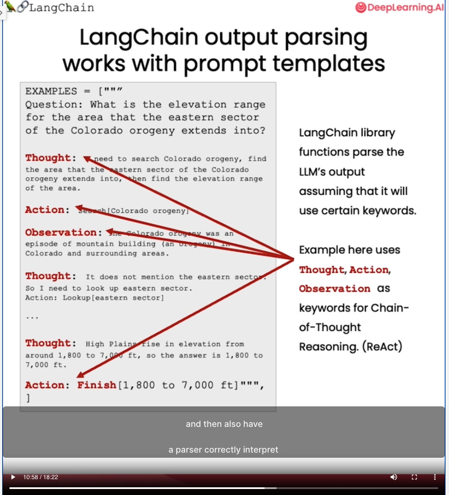
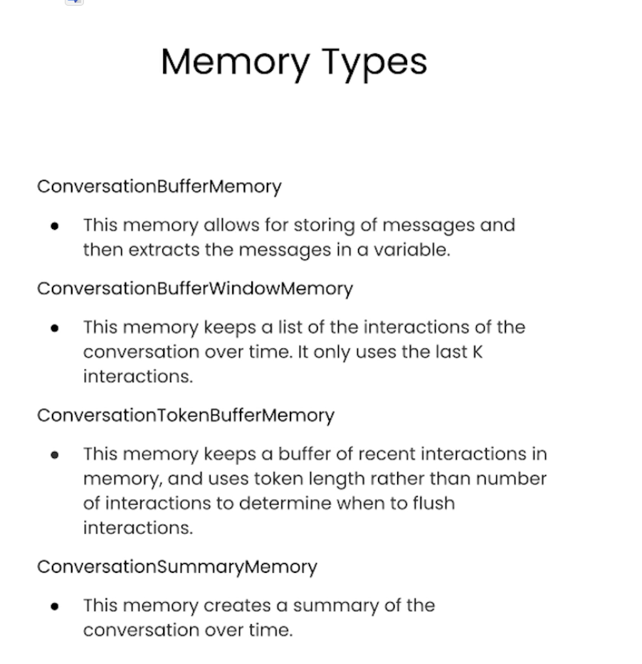
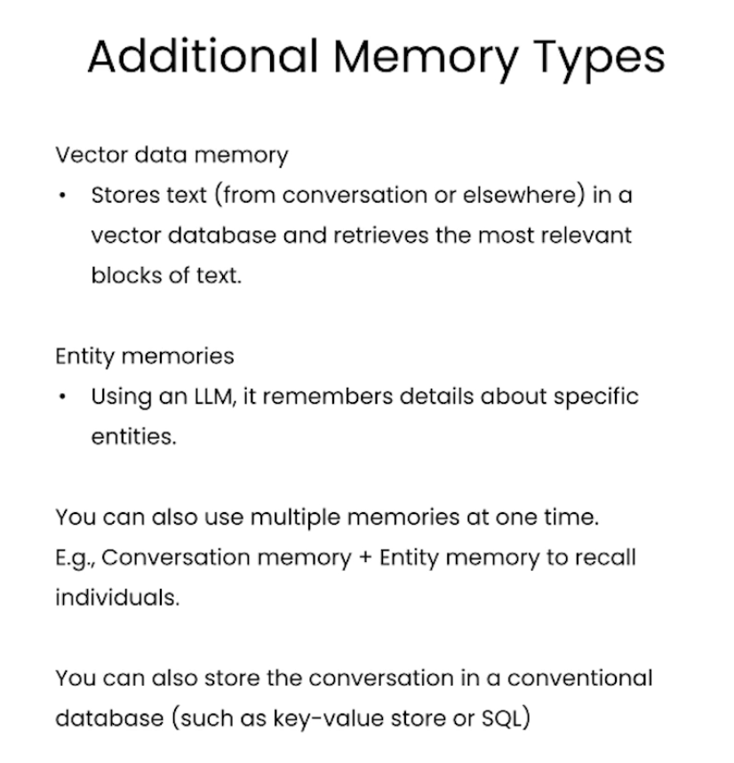
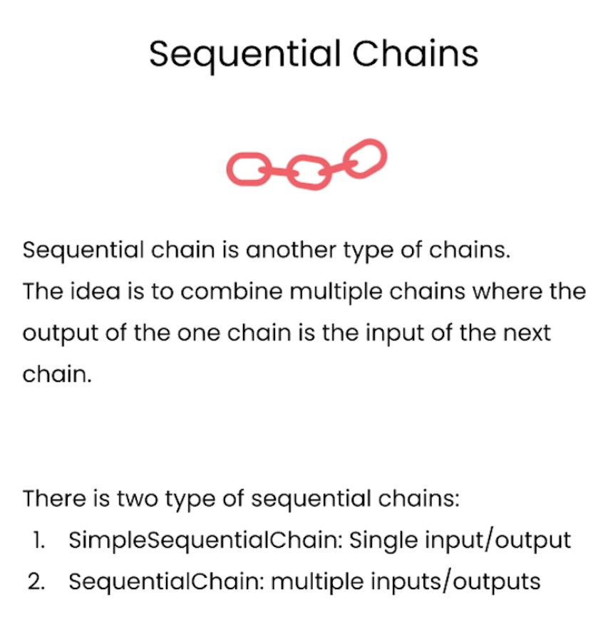
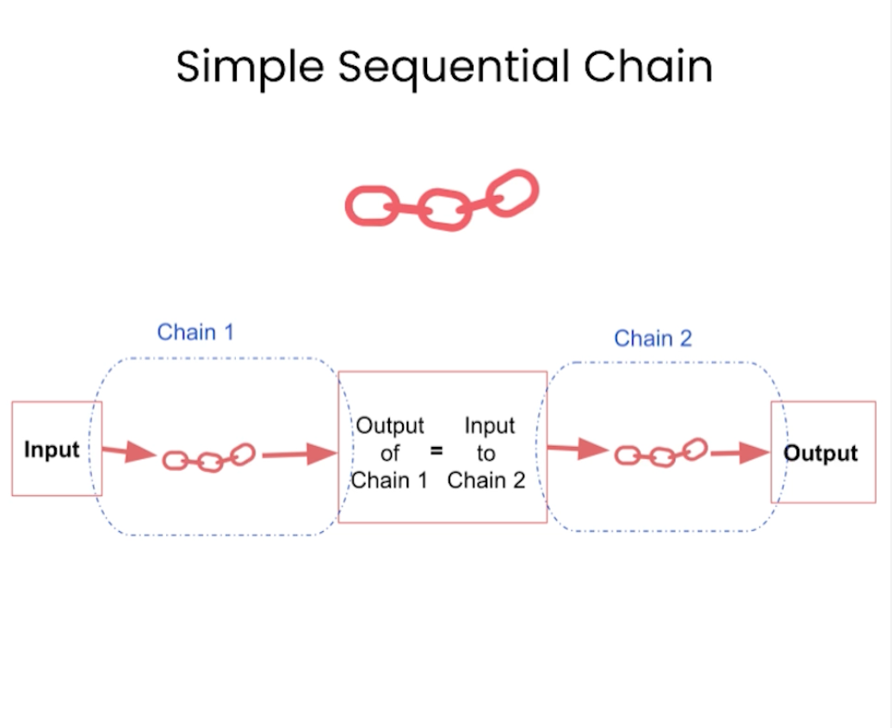
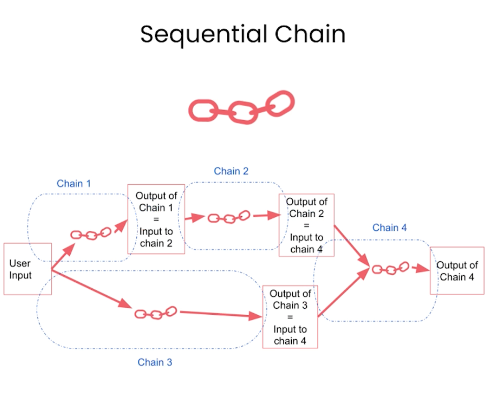
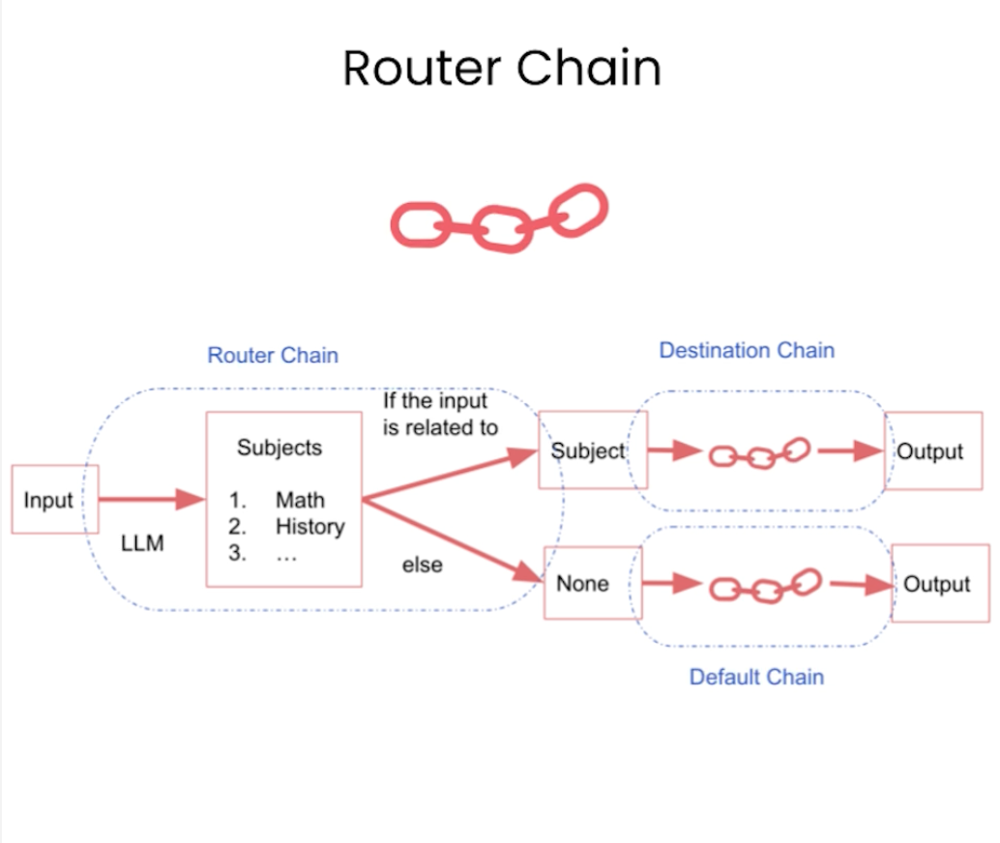

# [LangChain for LLM Application Development](https://learn.deeplearning.ai/langchain/lesson/1/introduction)

## Models, Prompts and Output Parsers

* Why Use Prompt Templates?

    - 

* LangChain APIs:

    - Models: `from langchain.chat_models import ChatOpenAI`

    - Prompt template: `from langchain.prompts import ChatPromptTemplate`

    - Parsers: `from langchain.output_parsers import ResponseSchema`
            `from langchain.output_parsers import StructuredOutputParser`

* LangChain output parsing works with prompt templates
    - Chain of Thought Reasoning (Using ReAct Framework)

    - 

* Vocabularies:

    - English pirate language

* Term:

    - downstream processing

## Memory

LangChain offers multiple sophisticated options of manageing these memories.....

    - ConversationBufferMemory

    - ConversationBufferWindowMemory

    - ConversationTokenBufferMemory

    - ConversationSummaryMemory

* Vocabularies:

    - utterance

## Chains

The chain usually combines an LLM together with a prompt, and with this building block you can also put a bunch of these building blocks together to carry out a sequence of operations on your text or on your other data.

* Sequential Chains

    -  Simple Sequential Chain

    

    - Sequential Chain

    

* Router Chain

* Vocabulary:

    - admit: When you don't know the answer to a question you admit that you don't know.

* API:

    - `from langchain.chains.router import MultiPromptChain`
    
    `MultiPromptChain` is a specific type of chain that is used when routing between multiple different prompt templates

    - `from langchain.chains.router.llm_router import LLMRouterChain,RouterOutputParser`

    `LLMRouterChain` this uses a language model itself to route between different subchains.

    `RouterOutputParser` This parses the LLM output into a dictionary that can be used downstream to determine which chain to use and what the input to that chain should be.

    - `from langchain.prompts import PromptTemplate`

    - `default_chais`: the chain that's called when router can't decide which of the subchains to use.

    - `MULTI_PROMPT_ROUTER_TEMPLATE`: this template is used by the LLM to route between different chains. This has instructions of the task to be done, as well as the specific formatting that the output should be in.

## Q&A over Documents
