# [LangChain for LLM Application Development](https./images//learn.deeplearning.a./images/langchai./images/lesso./images/./images/introduction)

## Models, Prompts and Output Parsers

* Why Use Prompt Templates?

    - 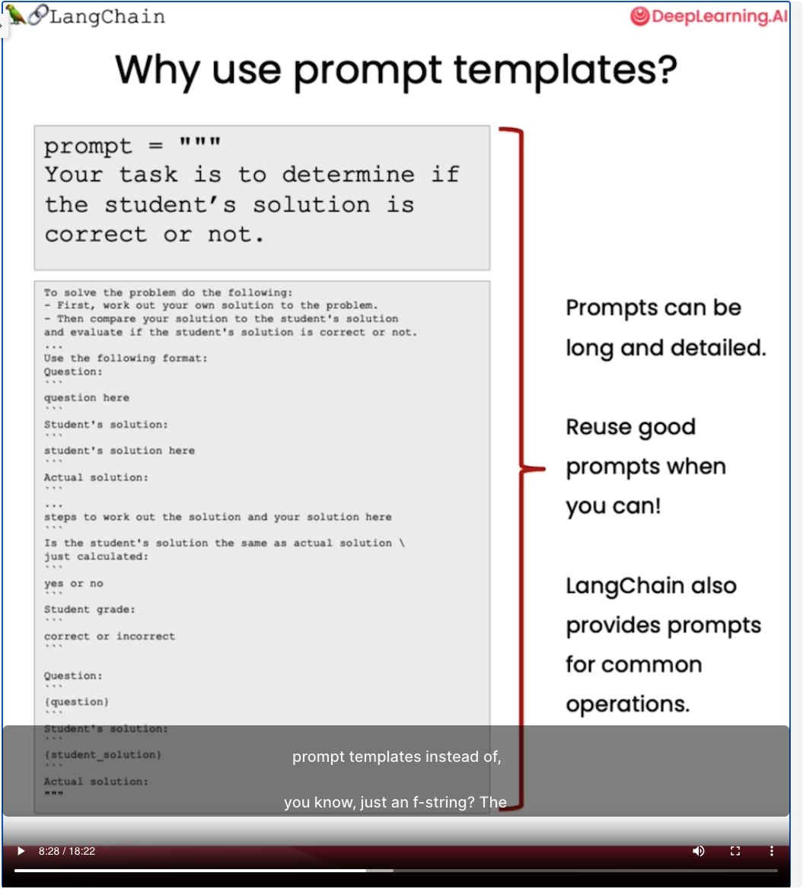

* LangChain APIs:

    - Models: `from langchain.chat_models import ChatOpenAI`

    - Prompt template: `from langchain.prompts import ChatPromptTemplate`

    - Parsers: `from langchain.output_parsers import ResponseSchema`
            `from langchain.output_parsers import StructuredOutputParser`

* LangChain output parsing works with prompt templates
    - Chain of Thought Reasoning (Using ReAct Framework)

    - 

* Vocabularies:

    - English pirate language

* Term:

    - downstream processing


## Memory

LangChain offers multiple sophisticated options of manageing these memories.....

    - ConversationBufferMemory

    - ConversationBufferWindowMemory

    - ConversationTokenBufferMemory

    - ConversationSummaryMemory

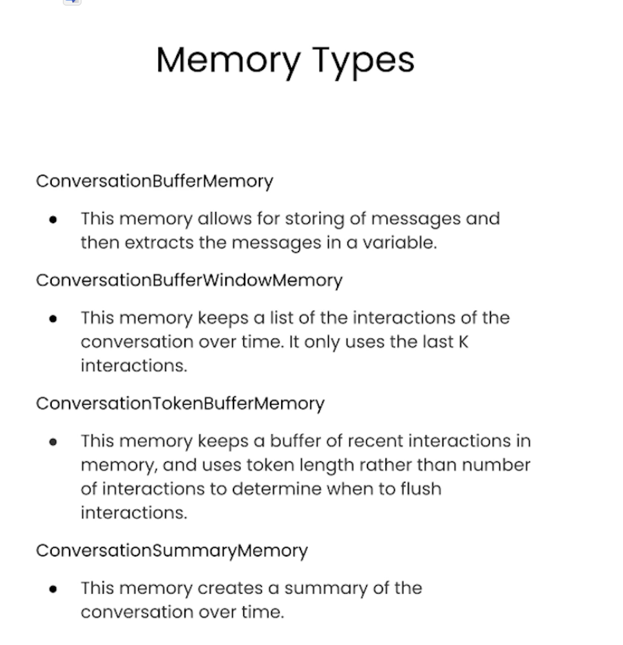

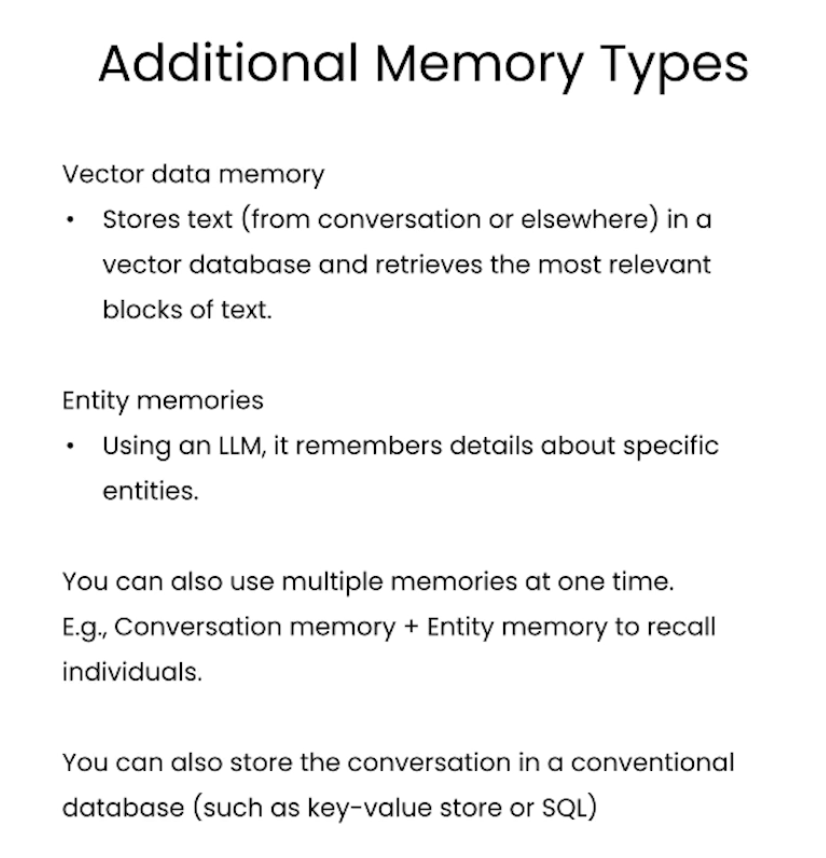

* Vocabularies:

    - utterance

    - flush

## Chains

The chain usually combines an LLM together with a prompt, and with this building block you can also put a bunch of these building blocks together to carry out a sequence of operations on your text or on your other data.

* Sequential Chains

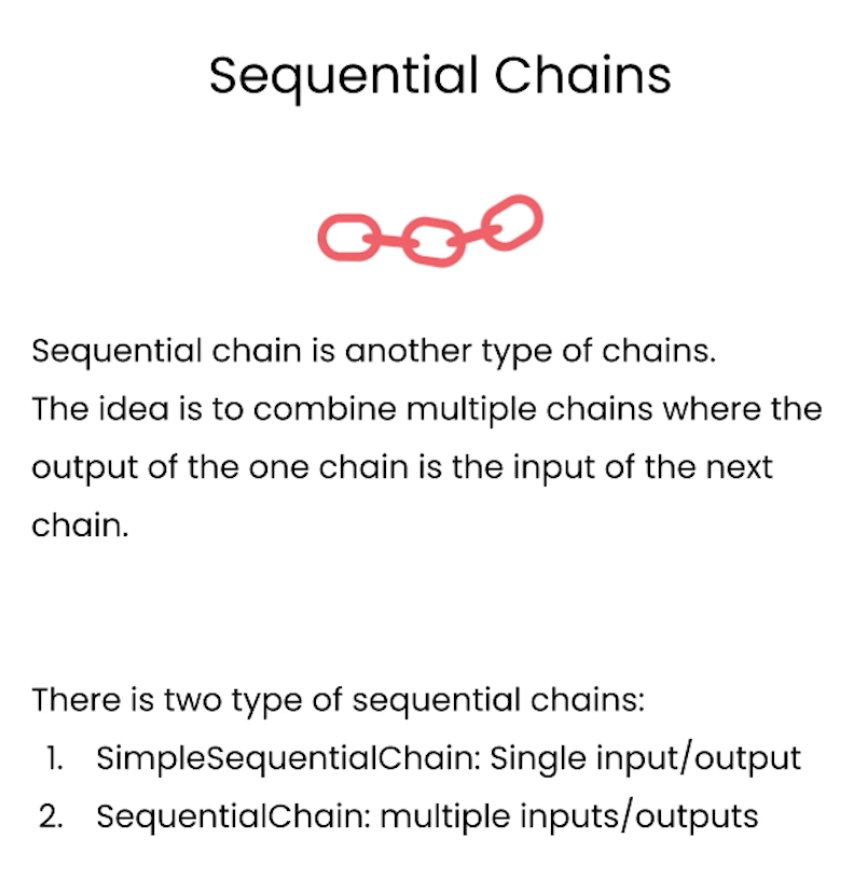

    -  Simple Sequential Chain

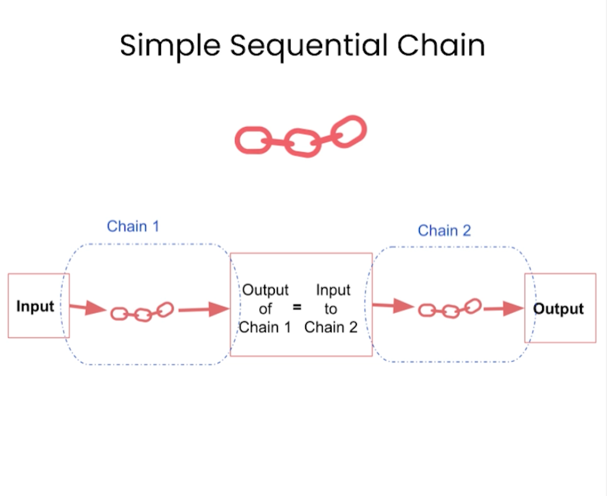

    - Sequential Chain

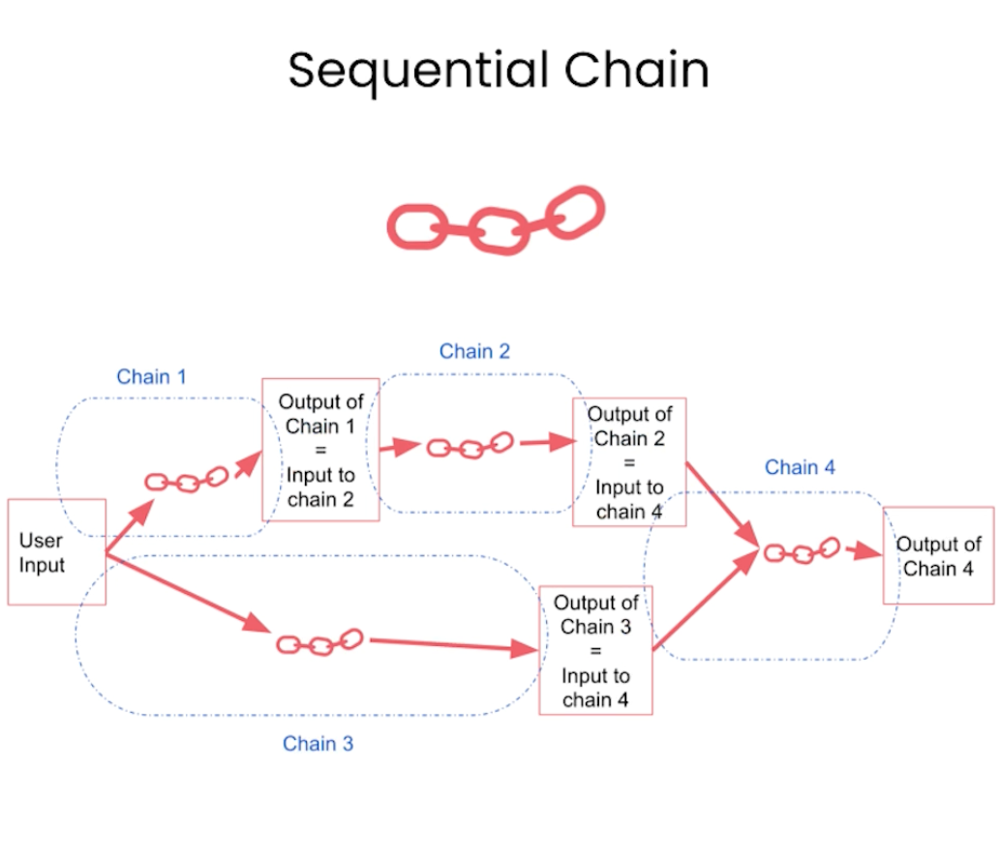

* Router Chain

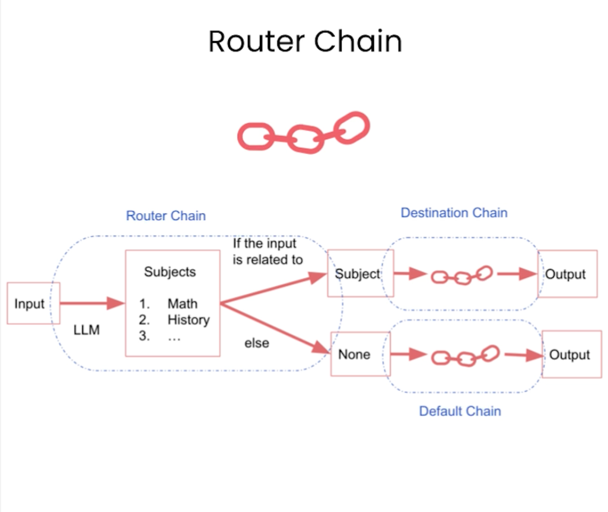

* Vocabulary:

    - admit: When you don't know the answer to a question you admit that you don't know.

* API:

    - `from langchain.chains.router import MultiPromptChain`
    
    `MultiPromptChain` is a specific type of chain that is used when routing between multiple different prompt templates

    - `from langchain.chains.router.llm_router import LLMRouterChain,RouterOutputParser`

    `LLMRouterChain` this uses a language model itself to route between different subchains.

    `RouterOutputParser` This parses the LLM output into a dictionary that can be used downstream to determine which chain to use and what the input to that chain should be.

    - `from langchain.prompts import PromptTemplate`

    - `default_chais`: the chain that's called when router can't decide which of the subchains to use.

    - `MULTI_PROMPT_ROUTER_TEMPLATE`: this template is used by the LLM to route between different chains. This has instructions of the task to be done, as well as the specific formatting that the output should be in.


## Q&A over Documents

**Keywords:** flexible and adaptable; proprietary data

Combine the LLM with data that they weren't originally trained on. So it makes them much more flexible and adaptable to your use case. 

It is also very exciting because we'll start to move beyond language models, prompts, and output parsers and start introducing some more of the key components of LangChain, such as **embedding models** and **vector stores**.

```
from langchain.chains import RetrievalQA
from langchain.chat_models import ChatOpenAI
from langchain.document_loaders import CSVLoader
from langchain.vectorstores import DocArrayInMemorySearch
from IPython.display import display, Markdown
```

* `RetrievalQA`: This chain will do retrieval over some documents.

* `document_loaders -> CSVLoader`: This is going to be used to load some proprietary data that we're going to combine with the language model.

* `vectorstores`

* `from langchain.indexes import VectorstoreIndexCreator`: This will help us create a vector store really easy.

### LLM's on Documents

* Key Issue: LLM's can only inspect a few thousand words at a time.

This is where embeddings and vector stores come into play.

* Embeddings:

    - Embeddings vector captures conten./images/meaning

    - Text with similar content will have similar vectors

* Vector Database:

A vector database is a way to store these vector representations that we created in the previous step. The way that we create this vector database is we populate it with **chunks of text**, coming from incoming documents. When we get a big incoming document, we're first going to break it up into smaller chunks. This helps create pieces of text that are smaller than original document, which is useful because we may not be able to pass the whole document to the language model. So we want to create these small chunks, we can only pass the most relevant ones to the language model.

We then create an embedding for each of these chunks, and we store those in a vector database. TThat's what happens when we create the index. 

Now that we's got this index, we can use it during runtime to find the pieces of text most relevant to an incoming query. When a query comes in, we first create an embeddings for that query. We then compare it to all vectors in the vector database, and we pick the 'n' most similar.

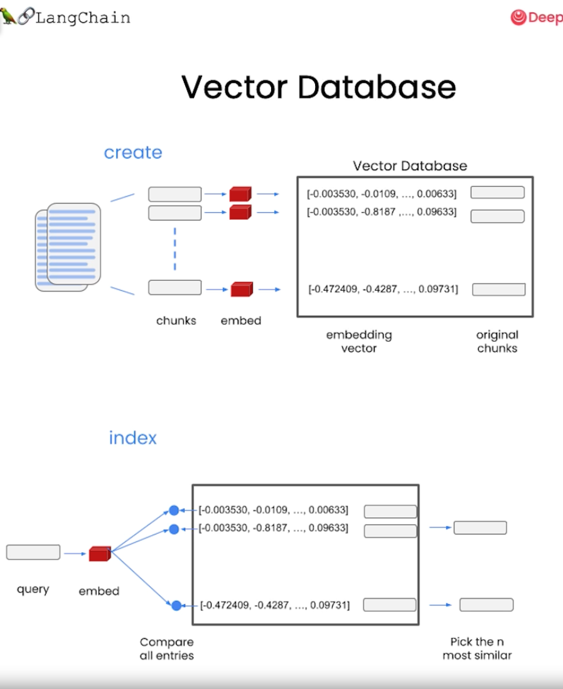

These are then returned, and we canpass those in the prompt to the LLM to get back a final answer.

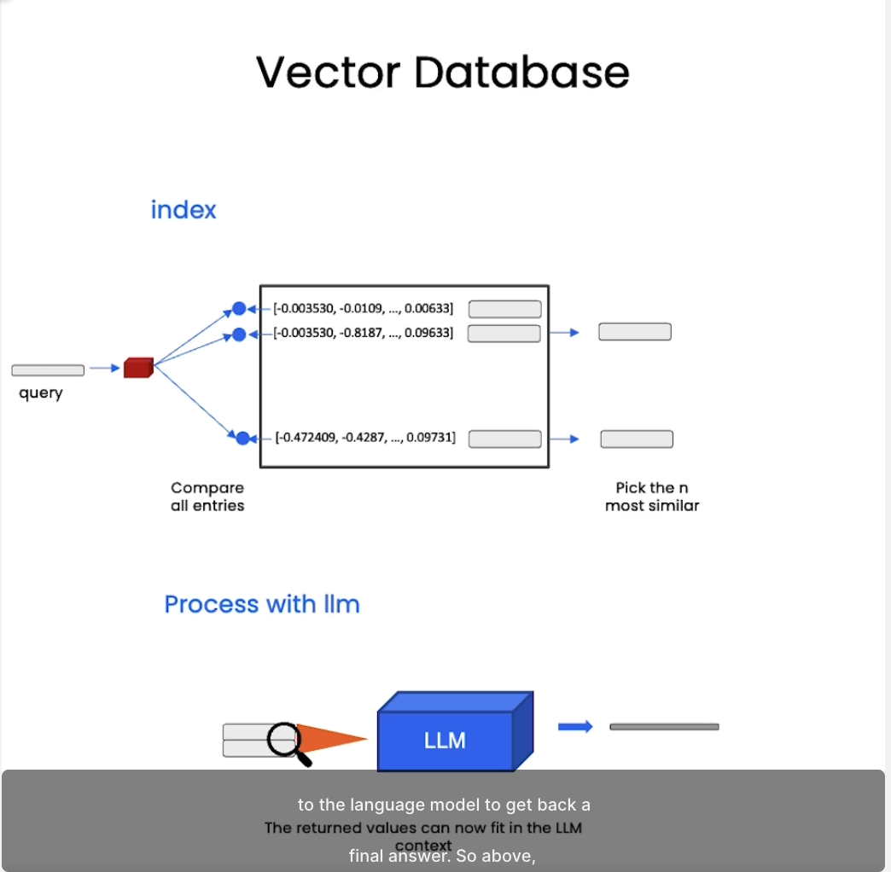

* Stuff method 

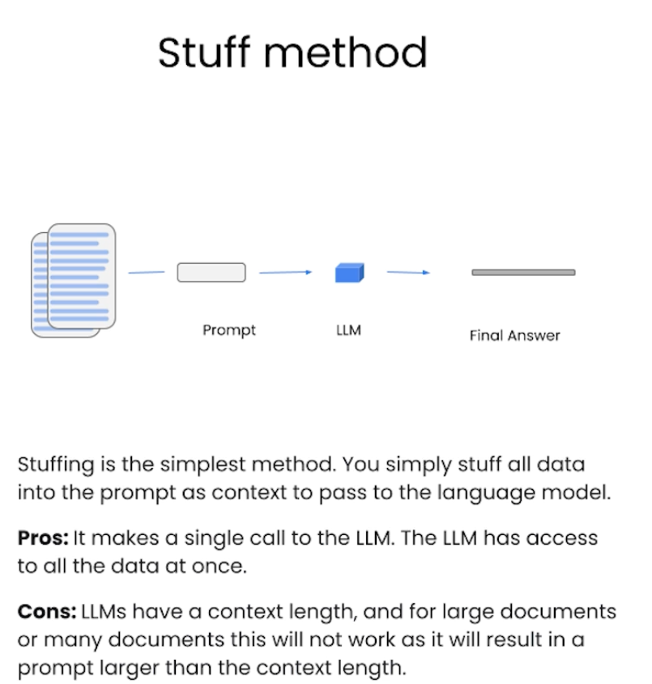

* 3 additional methods 

    - 1. Map reduce

    - 2. Refine

    - 3. Map rerank

The most common of these methods is the "stuff method", the second most common is the "Map Reduct" method, which takes these chunks and sends them to the language model.

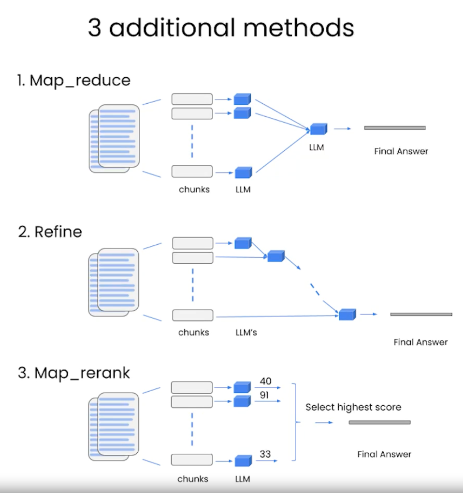

## Evaluation (Evaluating LLM Applications)

- Example generation

- Manual evaluation (and debuging)

- LLM-assisted evaluation

- LangChain evaluation platform

* Steps after create a Q & A App

    - First figure out what are some data points that we want to evaluate it on? there are a few methods: 
        * 1. the most simple which is basically we're goint to come up with data points that we think are good examples ourselves.

        * 2. automatic

* LangChain evaluation platform

* Vocabulary:

    - holistic

    - heuristic

## Agents

LLM: Knowledge Store ---> Reasoning Engine

* LangChain Tools:

    - `llm-math`

    - `wikipedia`

    - `PythonREPLTool`

* ReAct: a prompting strategy that elicits better thoughts from a language model.

* Vocabulary:

    - elicit
