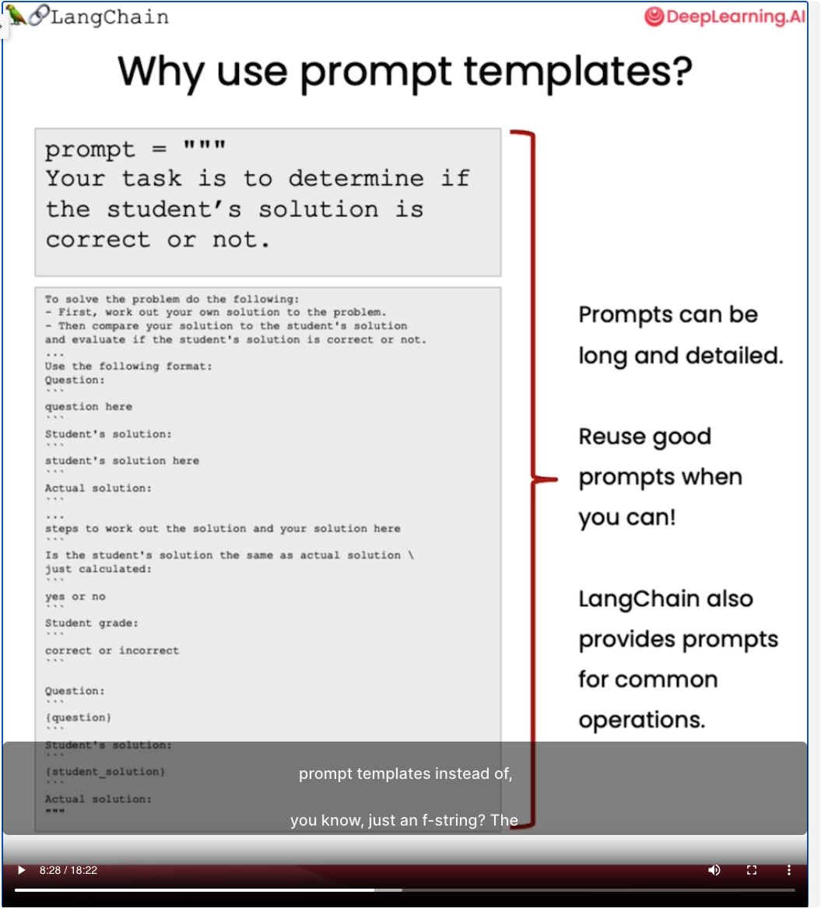

# [LangChain for LLM Application Development](https://learn.deeplearning.ai/langchain/lesson/1/introduction)

## Models, Prompts and Output Parsers

* Why Use Prompt Templates?

    - 

* LangChain APIs:

    - Models: `from langchain.chat_models import ChatOpenAI`

    - Prompt template: `from langchain.prompts import ChatPromptTemplate`

    - ``

* Vocabularies:

    - English pirate language
